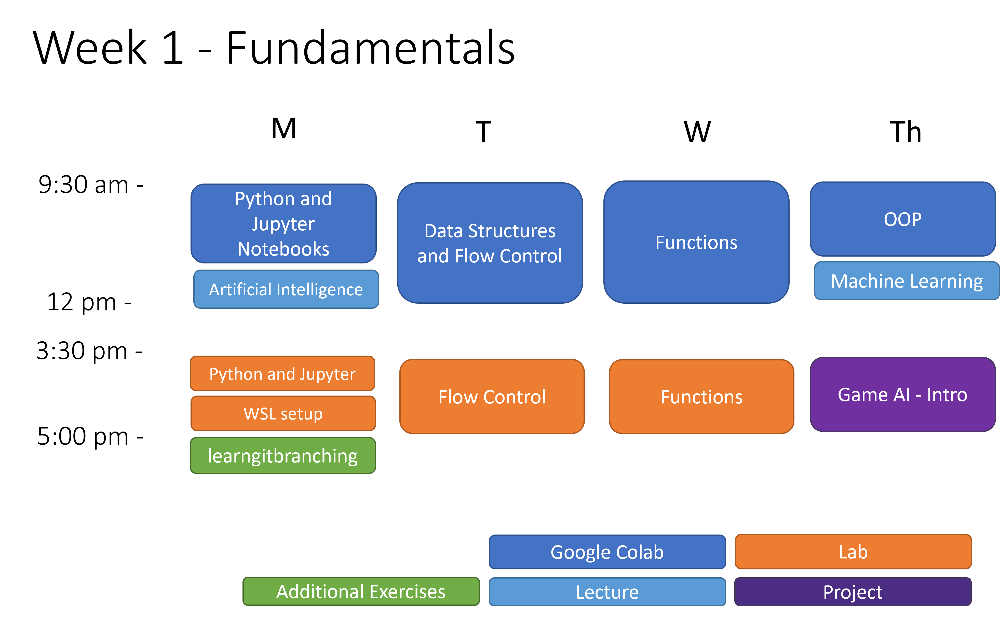
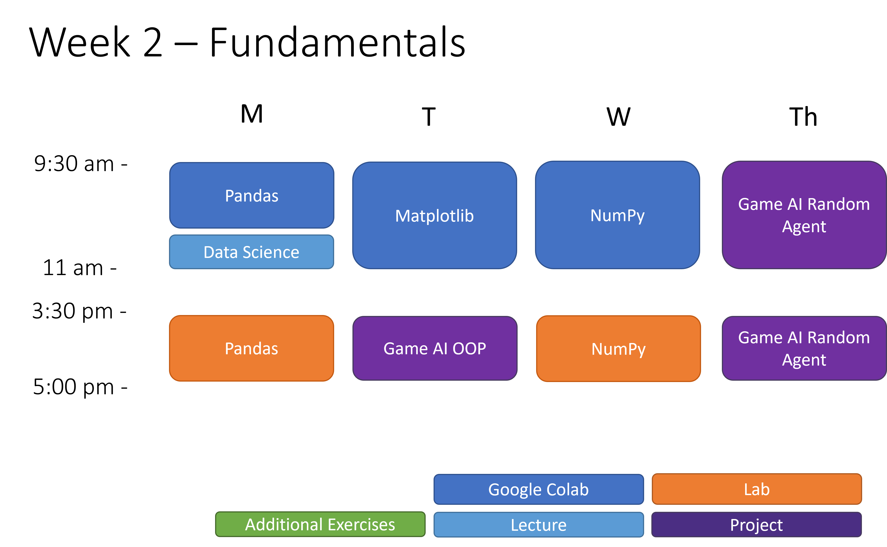
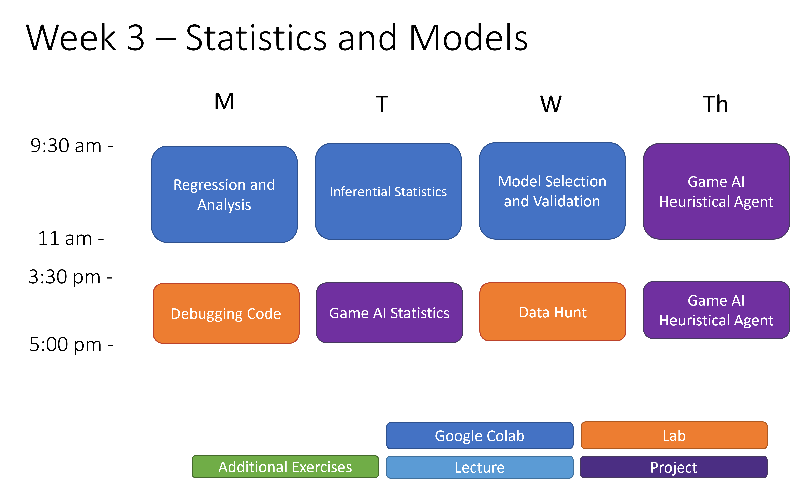
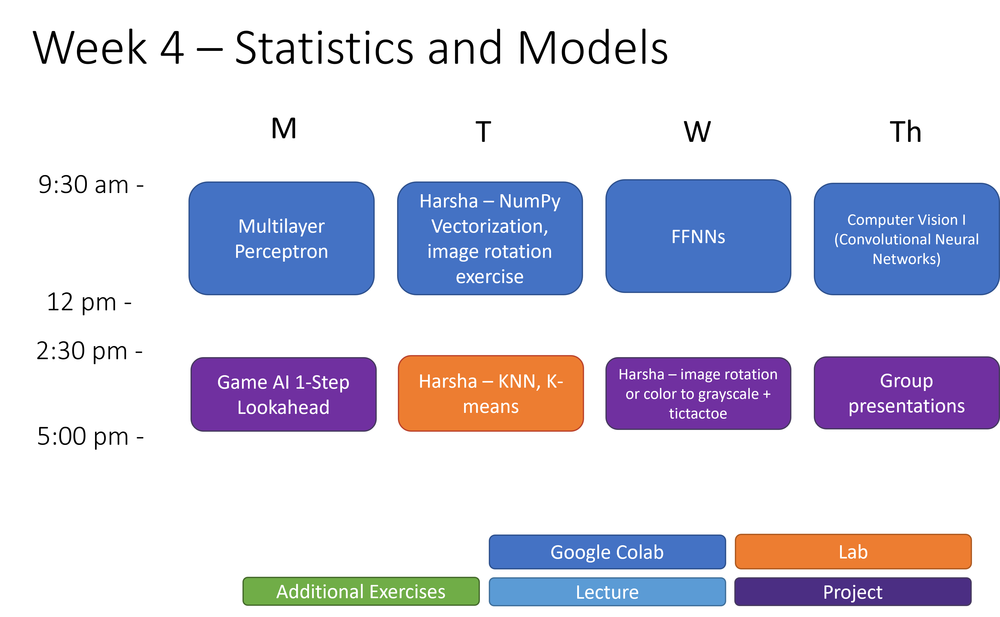

# technology_explorers

Companion Reading: [The Python Data Science Handbook](https://jakevdp.github.io/PythonDataScienceHandbook/)

## Series Overview

### Course 1: Fundamentals I

*	Data Science Topics
	   * Introduction to python; lists, dictionaries, and flow control; functions
*	Software Development Topics
	   * Object oriented programming
*	Project
	   * Tech Exp C1 P1: Building TicTacToe in Python
*	Sessions
	   * Tech Exp C1 S1: Introduction to Python and Jupyter Notebooks
	   * Tech Exp C1 S2: Data Structures and Flow Control
	   * Tech Exp C1 S3: Functions
	   * Tech Exp C1 S4: OOP
* Labs
     * Tech Exp C1 L1: Practice with Python and Jupyter Notebooks
     * Tech Exp C1 L2: Practice with Flow Control
     * Tech Exp C1 L3: Practice with Functions and Pandas
* Lecture
     * Artificial Intelligence
     * Machine Learning
 * Reading
     * JVDP chapters 1-2
 * Non Contact Hour
     * [learngitbranch](https://learngitbranching.js.org/) Introduction Sequence

</img>

 
 

### Course 2: Fundamentals I

*	Data Science Topics
	   *	Pandas; visualization: matplotlib, seaborn and pandas;
*	Software Development Topics
	   *	Debugging
*	Project
	   *	Tech Exp C2 P2 PART I: Game AI, OOP and Agents (OOP)
	   *	Tech Exp C2 P2 PART II: Game AI, OOP and Agents (Random Agent)
	   *	Tech Exp C2 P2 PART III: Game AI, OOP and Agents (Debugging)
*	Sessions
	   *	Tech Exp C2 S1: Pandas
	   *	Tech Exp C2 S2: Matplotlib
	   *	Tech Exp C2 S3: NumPy
 * Labs
     * Tech Exp C2 L1: Pandas
     * Tech Exp C2 L2: NumPy
 * Lecture
     * Data Science
 * Reading
     * JVDP chapters 3-4
     * INFO 370 [Statistical Golems](https://docs.google.com/document/d/1daYaEaAo7AVqxITspemGKoJTcundjWoJH8e_CkskMN4/edit)

</img>

 
 

### Course 3: Statistics and Models I

*	Data Science Topics
	   *	Bias-variance tradeoff; regression: linear, logistic, and multivariate; regularization: L1 and L2; inferential statistics: moods median, t-tests, f-tests, ANOVA; descriptive statistics: mean, median, mode, kurtosis, skew
*	Software Development Topics
	   *	Unit tests
*	Project
	   *	Tech Fun C3 P3: Game AI, Statistical Analysis
	   *	Tech Fun C3 P4: Game AI, Heuristical Agents
*	Sessions
	   *	Tech Fun C3 S1: Regression and Analysis
	   *	Tech Fun C3 S2: Inferential Statistics
	   *	Tech Fun C3 S3: Model Selection and Validation
 * Labs
     * Tech Fun C3 L1: Debugging Code
     * Tech Fun C3 L2: Data Hunt
 * Reading
     * JVDP chapter 5

</img>

 

### Course 4: Statistics and Models II

*	Data Science Topics
	   *	Neural networks: the perceptron, feed forward neural networks; computer vision: CNNs, importing and manipulating images
*	Project
	   *	Tech Fun C4 P5 Game AI, 1-step Look Ahead
	   *	Tech Fun C4 P6 Game AI, N-step Look Ahead
	   *	Tech Fun C4 P7 Game AI, Reinforcement Learning
*	Sessions
	   *	Tech Fun C4 S1: The Multilayer Perceptron
	   *	Tech Fun C4 S2: NumPy Vectorization
	   *	Tech Fun C4 S3: Feed Forward NNs
	   *	Tech Fun C4 S4: Computer Vision I
 * Labs
     * Tech Fun C4 L1: Neural Network Linearity
     * Tech Fun C4 L2: Unit Tests

</img>

 
 
